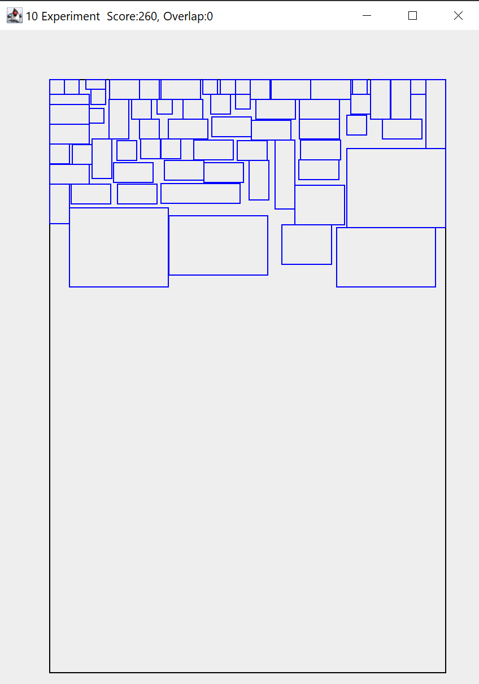

# Rectangle Puzzle Machine

## About
When I attended University in the last century, my first software development project was: A machine needs to cut a random number of rectangles with random sizes out of big sheets of metal. Develop a software that loads rectangles from a floppy disk and then place them on the big sheet with as few clippings as possible. Use an evolutionary algorithm to find the best solution. So basically start by throwing the rectangles randomly on the sheet of metal and then iteratively move each rectangle randomly a litle bit. Then calculate a fitness score of the solution by punishing overlaps of rectangles and rectangle positions that were out of bounds of the metal sheet. Run a lot of these experiments in parallel, and select the best result. In C. And without the help of google (since there was no Google back then :-) )
Long story short, our solution back then was really bad. Non-usuable bad. 
This was vexing me every now and then under the shower while reminiscing about the past.
So, since my kids are now into programming as well, on a rainy Sunday afternoon, I gave it another shot. Simplified. With Java.
Results look something like this:

## Rectangle Puzzle Machine
  - set the `numberOfObjects` in [ThreadeApp](./ThreadedApp.java) to desired number of experiments.
  - Run ThreadedApp.
  - The proceddings of the first experiment will be visualized.
  - All other status will be shown in the terminal.
  - After finishing all experiments, the terminal will output the time, the best result score and the experiment with the best result will be visualized.

## Benchmark Results

- On an AMD 7800X3D Desktop processor running windows 11 and __112__ experiments, it took __~103s__
- On a laptop with Windows 10/ Java 23  and AMD Ryzen PRO 5850U and __112__ experiments, it took __~261s__
- On an old Intel i5-6500 Desktop processor running linux and __112__ experiments, it took __~530s__

